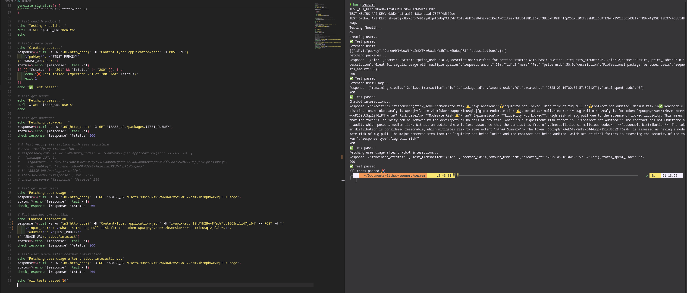
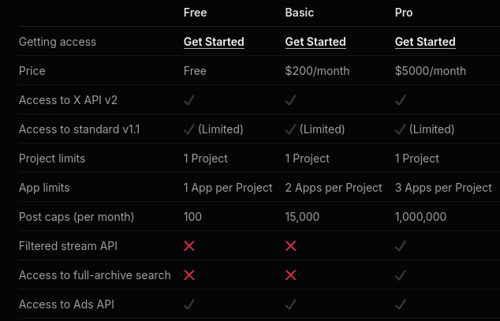
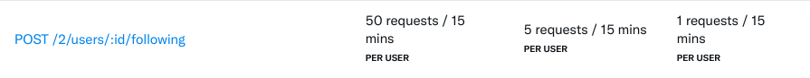

# SWQuery – Progress Report

## Overview

**SWQuery** is an innovative project aimed at democratizing access to blockchain data by enabling users to perform natural language, prompt-based queries. By abstracting the technical complexities of on-chain operations, SWQuery empowers both technical and non-technical users to extract actionable insights from the Solana blockchain. The platform is designed to be modular, extensible, and developer-friendly, with a focus on security, transparency, and usability.

This report details the progress achieved across five development sprints, highlighting technical milestones, challenges encountered, and strategic initiatives undertaken to ensure the project's growth and sustainability.

---

## Sprint 1 – Feature Planning

**Objective:**  
Establish the foundational scope and design for two core features:
- **Rug Pull Risk Analysis:** A tool to evaluate the likelihood of a Solana token being involved in fraudulent or rug pull schemes, leveraging on-chain data and behavioral heuristics.
- **Social Media Analysis:** A system to assess public sentiment and the perceived trustworthiness of blockchain projects by analyzing data from X (Twitter) and other social platforms.

**Key Activities:**
- Drafted detailed feature specifications, including user stories and acceptance criteria.
- Outlined the architecture, identifying key modules and integration points.
- Created and prioritized a backlog of development tasks for upcoming sprints.

**Outcome:**  
A clear product vision and actionable roadmap were established, setting the stage for focused development efforts.

---

## Sprint 2 – Development of Rug Pull Risk Analysis

**Objective:**  
Design, implement, and integrate the Rug Pull Risk Analysis feature into the SWQuery SDK.

**Technical Deliverables:**
- Developed a robust method for analyzing token metadata (e.g., creation date, supply, ownership distribution).
- Implemented heuristics to detect suspicious contract creation patterns, sudden liquidity movements, and anomalous ownership transfers.
- Built a backend API endpoint that accepts a token address and returns a comprehensive risk score, along with a breakdown of contributing factors.
- Integrated the analysis engine with the SDK, enabling seamless access for client applications.
- Established automated tests to validate risk assessment logic and ensure reliability.

    

**Outcome:**  
The Rug Pull Risk Analysis feature was successfully developed, tested, and integrated, providing users with actionable risk insights for any Solana token. The feature is now available for user testing and feedback.

---

## Sprint 3 – Social Media Analysis (Blocked by External Factors)

**Objective:**  
Initiate development of the Social Media Analysis feature, focusing on sentiment analysis and trust metrics using the X (Twitter) API.

**Challenges:**
- Discovered that access to Twitter's API required a paid tier with prohibitively high costs, exceeding the project's current budget.
- Explored alternative APIs and data providers, but none met the requirements for real-time, comprehensive data access.

    

    

**Actions Taken:**
- Documented the technical and financial constraints in detail.
- Engaged with the community and advisors to explore potential partnerships or sponsorships for API access.

**Outcome:**  
Development of the Social Media Analysis feature was paused due to external limitations. Transparency were prioritized by documenting the issue and began exploring alternative approaches.

---

## Sprint 4 – Plan B for Social Media Analysis

**Objective:**  
Devise and implement an alternative approach to social media analysis that does not rely on costly APIs.

**Approach:**
- Identified and sourced public datasets from Kaggle, containing historical social media data relevant to blockchain projects.
- Designed a data processing pipeline to extract sentiment, engagement metrics, and project mentions from these datasets.

**Limitations:**
- Public datasets are often outdated and may not reflect real-time sentiment, limiting the immediacy of insights.
- Data quality varies, necessitating extensive preprocessing, cleaning, and validation to ensure accuracy.
- Some relevant projects may have limited representation in available datasets.

**Outcome:**  
Plan B was successfully ellaborated, allowing continued development of the Social Media Analysis feature without incurring additional costs. The solution provides valuable, albeit less timely, sentiment insights and lays the groundwork for future enhancements as more data sources become available or the X API cost could be afforded.

---

## Sprint 5 – Ecosystem Engagement & Grant Preparation

**Objective:**  
Strengthen the project's strategic position within the Solana ecosystem and prepare for potential funding opportunities.

**Key Activities:**
- Organized and conducted a strategic meeting with Pedro Piccino (Kuka) from Superteam Brazil to discuss ecosystem alignment and funding pathways.
- Gathered insights on Solana Foundation Grant requirements, emphasizing the importance of milestone-based progress tracking and comprehensive documentation.
- Reviewed and refined technical documentation, ensuring clarity, completeness, and alignment with Solana's expectations.
- Compiled a detailed grant proposal, including project goals, architectural diagrams, current progress, and a forward-looking roadmap.
- Engaged with community members and potential partners to solicit feedback and support.

**Outcome:**  
SWQuery is now well-positioned to pursue Solana Foundation Grants and other funding opportunities. The project has strengthened its documentation, clarified its value proposition, and established connections within the Solana community, enhancing its prospects for long-term sustainability and impact.