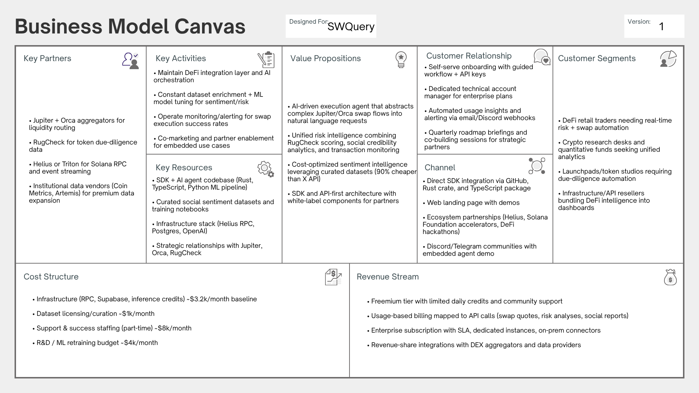

# SWQuery Business Model

## Executive Summary

SWQuery is a computational solution designed to simplify access to on-chain data on the Solana blockchain through natural language queries and high-level programmatic interfaces. The platform addresses the growing demand for tools that reduce technical complexity associated with blockchain data extraction while preserving performance, scalability, and reliability.

This document outlines the comprehensive business model for SWQuery, including market analysis, competitive positioning, revenue strategy, financial projections, and go-to-market approach. The business model is structured around a freemium subscription model targeting developers, analytics platforms, and Web3 infrastructure teams within the rapidly growing Solana ecosystem.

---

## Market Analysis and Competitive Positioning

### Market Sizing (TAM, SAM, SOM)

**Total Addressable Market (TAM):**
The global blockchain development tools market was valued at approximately USD 1.69 billion in 2024 and is projected to grow to USD 10.0 billion by 2035. This broad category includes middleware, debugging tools, smart contract frameworks, and analytics solutions for decentralized technologies.

**Serviceable Available Market (SAM):**
SWQuery targets developers, analytic platforms, and infrastructure services specifically within high-performance blockchain ecosystems such as Solana. Solana's developer ecosystem continues to grow, with reports indicating between 2,500 and 3,000 monthly active developers on open-source repositories, complemented by thousands more in private development. Ecosystem growth metrics show that Solana attracted 7,625 new developers in 2024 alone, the largest annual onboarding among major blockchain ecosystems.

**Serviceable Obtainable Market (SOM):**
Considering competitive tooling, developer adoption rates, and SWQuery's focus on high-value users (analytics platforms, compliance teams, RPC providers), a conservative estimate assumes capturing 5% to 10% of active Solana developers in the near term. With an estimated 3,000 monthly active developers, this implies approximately 150 to 300 core users initially engaging with SWQuery's product offerings.

### Customer Segmentation and Target Audience

**Primary Audience:**
- **Developers:** Software developers and technical teams building applications that interact with the Solana blockchain
- **Data Scientists:** Professionals requiring structured blockchain data for analytics and research
- **Web3 Infrastructure Teams:** Organizations building infrastructure services, compliance tools, and monitoring solutions

**Secondary Audience:**
- **Blockchain Analysts:** Professionals analyzing on-chain data for insights and trends
- **DeFi Researchers:** Researchers studying decentralized finance protocols and behaviors
- **Institutional Users:** Organizations leveraging standardized on-chain datasets for decision-making

**Customer Persona Characteristics:**
- Intermediate to advanced programming skills
- May lack deep expertise in blockchain infrastructure or low-level RPC calls
- Value tools that reduce cognitive load and abstract technical complexity
- Willing to pay for solutions that deliver clear productivity gains
- Prefer predictable costs and reliable infrastructure
- Time-constrained, fast-paced development environments

**Key Customer Needs:**
- Reliable, low-latency access to on-chain data
- Abstraction from raw RPC complexities
- Structured, standardized outputs formatted for immediate integration
- Reduced development time and engineering effort
- Easy integration into existing workflows

### SWOT Analysis

**Strengths:**
- Developer-centric design and natural language query interface reducing technical barriers
- Standardized, structured outputs that streamline integration
- Freemium pricing model and open-source foundations increasing accessibility
- Abstraction of low-level protocols focusing on usability
- Differentiates from raw infrastructure providers and complex analytics dashboards

**Weaknesses:**
- Limited ecosystem visibility compared to established platforms (Dune Analytics, The Graph)
- Dependency on third-party providers (Helius RPC) introducing performance/pricing risk
- Potential limitations for highly customized analytical workflows requiring fine-grained control
- Smaller market penetration compared to competitors with large communities

**Opportunities:**
- Rapid growth of Solana ecosystem and demand for blockchain data access
- Expansion of AI-native analytics solutions and enterprise offerings
- Integration with intelligent workflows and on-chain agent platforms
- Growing market of users needing scalable, standardized data access
- Broader adoption of AI and automation in Web3 development

**Threats:**
- Competition from established analytics giants (Dune Analytics, The Graph)
- Decentralized indexing protocols providing powerful alternatives
- AI-driven analytics platforms building proprietary indexing services
- Regulatory changes affecting data access
- Network performance issues or shifts in developer preferences

### Competitive Analysis

SWQuery competes in a market with established players across three categories:

**Research Analyst Agents:**
- Agent Scarlett, ASYM, ZODS, Limitus AI, AIPump, DeFi Agents AI, GEMXBT, KWANT, TriSigma

**Abstraction Layers:**
- Strawberry AI, Mode Network, Spectral Labs, Orbit, GRIFFAIN, Hive, Neur

**Onchain Execution:**
- CATG, PPCOIN, MOBY, ALR, WHISP, OCADA, DIGGAI

**Key Competitive Differentiators:**
- **Transparency:** Open-source vs. closed-source competitors
- **Pricing:** Clear, fair freemium model vs. hidden fees and non-refundable payments
- **Developer Experience:** Natural language interface vs. complex query languages
- **Cost Efficiency:** 90% cost reduction in social intelligence vs. expensive API alternatives
- **Documentation:** Comprehensive guides vs. limited documentation

---

## Business Model Canvas

  

| Block | Details |
| --- | --- |
| **Customer Segments** | • DeFi retail traders needing real-time risk + swap automation • Crypto research desks and quantitative funds seeking unified analytics • Launchpads/token studios requiring due-diligence automation • Infrastructure/API resellers bundling DeFi intelligence into dashboards |
| **Value Propositions** | • AI-driven execution agent that abstracts complex Jupiter/Orca swap flows into natural language requests • Unified risk intelligence combining RugCheck scoring, social credibility analytics, and transaction monitoring • Cost-optimized sentiment intelligence leveraging curated datasets (90% cheaper than X API) • SDK and API-first architecture with white-label components for partners |
| **Channels** | • Direct SDK integration via GitHub, Rust crate, and TypeScript package • Web landing page with interactive demos • Ecosystem partnerships (Helius, Solana Foundation accelerators, DeFi hackathons) • Discord/Telegram communities with embedded agent demo |
| **Customer Relationships** | • Self-serve onboarding with guided workflow + API keys • Dedicated technical account manager for enterprise plans • Automated usage insights and alerting via email/Discord webhooks • Quarterly roadmap briefings and co-building sessions for strategic partners |
| **Revenue Streams** | • Freemium tier with limited daily credits and community support • Usage-based billing mapped to API calls (swap quotes, risk analyses, social reports) • Enterprise subscription with SLA, dedicated instances, on-prem connectors • Revenue-share integrations with DEX aggregators and data providers |
| **Key Resources** | • SDK + AI agent codebase (Rust, TypeScript, Python ML pipeline) • Curated social sentiment datasets and training notebooks • Infrastructure stack (Helius RPC, Supabase/Postgres, OpenAI) • Strategic relationships with Jupiter, Orca, RugCheck |
| **Key Activities** | • Maintain DeFi integration layer and AI orchestration • Constant dataset enrichment + ML model tuning for sentiment/risk • Operate monitoring/alerting for swap execution success rates • Co-marketing and partner enablement for embedded use cases |
| **Key Partners** | • Jupiter + Orca aggregators for liquidity routing • RugCheck for token due-diligence data • Helius for Solana RPC and event streaming • Institutional data vendors (Coin Metrics, Artemis) for premium data expansion |
| **Cost Structure** | • Infrastructure (RPC, Supabase, inference credits) ~$3.2k/month baseline • Dataset licensing/curation ~$1k/month • Support & success staffing (part-time) ~$8k/month • R&D / ML retraining budget ~$4k/month |

### 1. Value Propositions

**Core Value:**
- Abstracting complex on-chain data access into natural language queries with structured, developer-ready outputs
- Removing need for deep blockchain-specific knowledge
- Reducing technical complexity, development time, and operational friction
- Transforming raw blockchain data into structured, actionable information

**Key Benefits:**
- Natural language query interface eliminating need for complex RPC knowledge
- Standardized, structured outputs ready for immediate integration
- AI-powered risk analysis and market insights
- Cost-effective social intelligence (90% cost reduction vs. X API)
- Seamless DeFi integrations (Jupiter swaps, token analysis)
- Real-time subscriptions for account, token, and new token events

### 2. Customer Segments

**Primary Segments:**
- Solana-focused developers
- Analytics and research platforms
- Compliance and monitoring tools
- Blockchain infrastructure services

**Characteristics:**
- Technical professionals and organizations
- Seeking productivity gains and faster integration cycles
- Require reliable and scalable access to on-chain data
- Value developer experience and ease of integration

### 3. Channels

**Distribution Channels:**
- Direct SDK adoption
- Online documentation and integration guides
- Ecosystem-driven discovery through developer communities
- Hackathons, technical forums, blockchain-focused events
- Open-source communities and GitHub

**Customer Acquisition:**
- Organic channels: technical content, documentation, sample implementations
- Real-world use case demonstrations
- Free usage tier encouraging experimentation
- Community engagement and partnerships

### 4. Customer Relationships

**Relationship Model:**
- Product-led and self-service approach
- Onboarding through documentation and integration guides
- Usage guidance and troubleshooting via documentation and community support
- Community-driven support (Discord, forums)
- Enterprise support tiers for organizational customers

**Retention Strategy:**
- Consistent value delivery through reliable performance
- Clear productivity gains and time savings
- Continuous introduction of new features aligned with user needs
- Subscription-based plans with higher query limits and advanced functionalities
- Regular updates and improvements reinforcing user trust

### 5. Revenue Streams

**Freemium Subscription Model:**
- **Free Tier:** 3 free queries per day for onboarding and initial adoption
- **Starter:** $10 USDC/month for individual developers and light usage
- **Basic:** $30 USDC/month for moderate usage and small teams
- **Pro:** $50 USDC/month for heavy usage and organizational integrations

**Revenue Characteristics:**
- Paid tiers based on query volume and usage intensity
- No expiration on purchased query credits
- Scalable pricing aligned with usage patterns
- Enterprise licensing available for institutional users

### 6. Key Resources

**Core Resources:**
- Software codebase (open-source Rust SDK)
- Cloud infrastructure for hosting and scaling
- Access to reliable RPC services (Helius)
- Specialized technical expertise in blockchain systems and data engineering
- Community and ecosystem partnerships
- Comprehensive documentation and developer resources

### 7. Key Activities

**Primary Activities:**
- Continuous SDK development and maintenance
- Query interpretation and optimization
- Integration with Solana RPC and infrastructure providers
- Iterative improvement of data abstraction layers
- AI model integration and optimization
- Community building and developer engagement
- Technical documentation and support

### 8. Key Partnerships

**Strategic Partnerships:**
- **Blockchain Infrastructure:** Helius RPC (data availability, performance, scalability)
- **DeFi Protocols:** Jupiter (token swaps), Orca (fallback DEX)
- **Ecosystem:** Solana Foundation (grants, ecosystem support)
- **Community:** Superteam Brazil (ecosystem alignment, grant preparation)
- **Risk Analysis:** RugCheck API (token risk assessment)

**Partnership Benefits:**
- Efficient operation without proprietary node infrastructure overhead
- Rapid scaling as demand grows
- Enhanced reliability and performance
- Ecosystem integration and visibility

### 9. Cost Structure

**Monthly Operating Costs:**
- **Infrastructure & API Usage:** $200/month (RPC credits, cloud services, OpenAI API)
- **Development & Maintenance:** $500/month (team hours, tooling, infrastructure)
- **Marketing & Acquisition:** $300/month (content, community, sponsorships)
- **Operational Overhead:** $100/month
- **Total Estimated Monthly Costs:** ~$1,100

**Cost Characteristics:**
- Primarily driven by infrastructure consumption and API usage
- Scalable cost structure aligned with revenue growth
- Low initial investment requirement
- Variable costs tied to usage volume

---

## Marketing and Sales Strategy

### Go-to-Market Approach

**Strategy:** Developer-first and product-led growth

**Launch Strategy:**
- Initial exposure to Solana developer ecosystem
- Open-source communities, hackathons, technical forums
- Blockchain-focused events and conferences
- Direct engagement with developers experiencing complex on-chain data access challenges

### Customer Acquisition

**Primary Channels:**
- **Organic:** Technical content, documentation, sample implementations
- **Community:** Developer forums, Discord, GitHub, technical blogs
- **Events:** Hackathons, blockchain conferences, Solana ecosystem events
- **Partnerships:** Integration with infrastructure providers, ecosystem collaborations

**Acquisition Tactics:**
- Free usage tier lowering initial barrier to adoption
- Comprehensive documentation and integration guides
- Real-world use case demonstrations
- Open-source transparency building trust
- Community engagement and support

### Retention Strategy

**Key Retention Drivers:**
- Consistent value delivery through reliable performance
- Clear productivity gains and development time savings
- Continuous feature introduction aligned with user needs
- Subscription-based plans incentivizing long-term usage
- Higher query limits and advanced functionalities for paid tiers
- Regular updates and improvements reinforcing user trust

---

## Financial Projections and Feasibility

### Revenue Model and Pricing Structure

**Pricing Tiers:**
- **Free Tier:** 3 free queries per day (onboarding and initial adoption)
- **Starter:** $10 USDC/month (individual developers, light usage)
- **Basic:** $30 USDC/month (moderate usage, small teams)
- **Pro:** $50 USDC/month (heavy usage, organizational integrations)

### Year 1 Financial Projections

**Assumptions:**
- Conservative 3% freemium → paid conversion (industry benchmark: 2-5% for SaaS)
- Initial total user base: 3,000 developers (reflecting ecosystem activity)
- Tier distribution: Starter 50%, Basic 30%, Pro 20%

**Revenue Projections:**
- **Total Paid Users:** ~90 users (3% of 3,000)
- **Starter (50%):** 45 users × $10 = $450/month
- **Basic (30%):** 27 users × $30 = $810/month
- **Pro (20%):** 18 users × $50 = $900/month
- **Total MRR:** ~$2,160/month
- **Total ARR:** ~$25,920/year

### Projected Expenses

**Monthly Operating Costs:**
- Infrastructure & API usage: $200
- Development & maintenance: $500
- Marketing & acquisition: $300
- Operational overhead: $100
- **Total Monthly Costs:** ~$1,100

### Break-Even Analysis

**Break-Even Point:**
- With MRR of ~$2,160 and monthly costs of ~$1,100
- Projected operational break-even by end of Year 1
- Break-even within 12-18 months feasible for product-led tools with strong developer adoption
- Positive cash flow: ~$1,060/month after break-even

### Return on Investment (ROI)

**Initial Investment:**
- Product development: $10,000
- Tooling and infrastructure setup
- Initial community programs and marketing

**ROI Timeframe:**
- Projected ROI: ~18-24 months
- Revenue scales while fixed costs are amortized
- Sustainable unit economics supporting long-term growth

---

## Key Performance Indicators (KPIs)

### Revenue & Usage Metrics

**Monthly Recurring Revenue (MRR):**
- Year 1: ~$2,160/month
- Growth trajectory aligned with user acquisition

**Annual Recurring Revenue (ARR):**
- Year 1: ~$25,920
- Scalable model supporting growth

**Average Revenue Per User (ARPU):**
- Weighted average: (45×$10 + 27×$30 + 18×$50) ÷ 90 ≈ $24/month per paid user

### Customer Metrics

**Customer Acquisition Cost (CAC):**
- ~$120 per customer (industry benchmark for developer SaaS tools)
- Organic acquisition channels keeping CAC low

**Customer Lifetime Value (LTV):**
- Assuming 5% annual churn and ARPU of $24/month
- LTV = (24 × 12) × (1 / 0.05) ≈ $576 per customer

**LTV:CAC Ratio:**
- LTV: ~$576
- CAC: ~$120
- **Ratio: 4.8:1** (healthy ratio, indicating sustainable unit economics)
- Industry benchmark: 3:1 or better

### Retention Metrics

**Churn Rate:**
- Estimated ~5% per month initially
- Decreasing over time as product-market fit improves
- Typical SaaS churn: 5-7% monthly

**Net Revenue Retention (NRR):**
- Expected >100% with upsells and plan upgrades
- Starter → Basic/Pro upgrades driving expansion revenue
- Inline with SaaS best practices

---

## Market Validation and Results

### Validation Methodology

**Approach:**
- Qualitative and exploratory methods
- Informal interviews with developers
- Feedback collected during technical demonstrations
- Hands-on MVP usage by early users
- Real development scenario testing

**Validation Focus:**
- Technical acceptance of MVP
- Perceived value among potential users
- Usability, performance, and feature relevance
- Integration effort and response quality

### Market Validation Results

**Key Findings:**
- **Strong Interest:** Simplified blockchain data access particularly valued by developers not specialized in low-level Solana infrastructure
- **Key Benefits Identified:** Reductions in development time, improved clarity of data outputs
- **No Major Pivots Required:** Feedback informed refinements rather than fundamental changes
- **Core Value Proposition Validated:** Iterative improvements reinforced existing business model

**User Feedback Highlights:**
- Positive reception to natural language interface
- Appreciation for structured, standardized outputs
- Value recognition for time savings and reduced complexity
- Interest in expanding feature set

---

## Risks and Mitigation Plan

### Technological Risks

**Risk:** Dependency on third-party infrastructure providers (Helius RPC)
**Mitigation:** Modular design choices, alignment with established ecosystem standards, fallback mechanisms

**Risk:** Potential changes in blockchain protocols
**Mitigation:** Active monitoring of protocol updates, flexible architecture supporting adaptation

**Risk:** API rate limiting and performance variability
**Mitigation:** Caching strategies, request optimization, fallback providers

### Business Risks

**Risk:** Competition from established analytics platforms
**Mitigation:** Strong focus on developer experience, continuous innovation in natural language interfaces, open-source transparency

**Risk:** Infrastructure providers expanding into higher-level abstractions
**Mitigation:** Unique value proposition, community engagement, strategic partnerships

**Risk:** Market adoption challenges
**Mitigation:** Freemium model reducing barriers, comprehensive documentation, community building

### Financial Risks

**Risk:** Limited due to low initial investment requirement and scalable cost structure
**Mitigation:** Conservative financial projections, phased growth approach, sustainable unit economics

### Legal and Regulatory Risks

**Risk:** Compliance and data usage regulations
**Mitigation:** Relying exclusively on publicly available on-chain data, avoiding custody of user assets, transparent data handling practices

---

## Growth Strategy and Future Roadmap

### Short-term Growth (Next 6 Months)

- Expand user base through community engagement and partnerships
- Enhance documentation and developer resources
- Implement feedback-driven feature improvements
- Strengthen ecosystem partnerships (Jupiter, Orca, Helius)
- Increase visibility through hackathons and technical content

### Medium-term Growth (6-12 Months)

- Multi-chain expansion (Ethereum, Base, etc.)
- Additional AI agent integrations (Claude, DeepSeek)
- Advanced analytics and reporting features
- Enterprise features and white-label solutions
- Strategic partnerships with major infrastructure providers

### Long-term Vision (12+ Months)

- Decentralized infrastructure options
- Cross-chain intelligence and analytics
- AI agent marketplace
- Institutional-grade security and compliance
- Market leadership in DefAI data access

---

## Conclusion

SWQuery's business model is designed for sustainable growth within the rapidly expanding Solana ecosystem. The freemium subscription model balances accessibility with monetization, while the developer-first approach ensures strong product-market fit. With conservative financial projections demonstrating break-even within Year 1 and healthy unit economics (LTV:CAC ratio of 4.8:1), SWQuery is positioned for long-term success.

The open-source, transparent approach differentiates SWQuery from closed-source competitors, while strategic partnerships and ecosystem integration provide scalability and reliability. Market validation confirms strong interest and value recognition, supporting the business model's viability.

As the Solana ecosystem continues to grow and demand for simplified blockchain data access increases, SWQuery is well-positioned to capture market share and establish itself as a leading platform for on-chain data accessibility in the DefAI space.

---

*This business model document is based on comprehensive market analysis, competitive research, financial modeling, and market validation conducted throughout the SWQuery project development lifecycle.*

